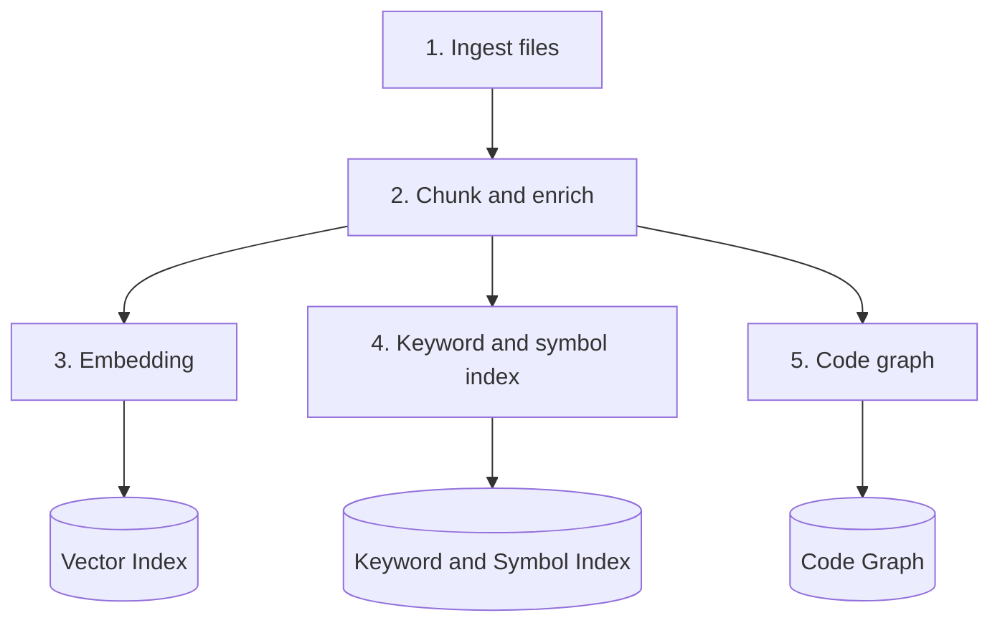
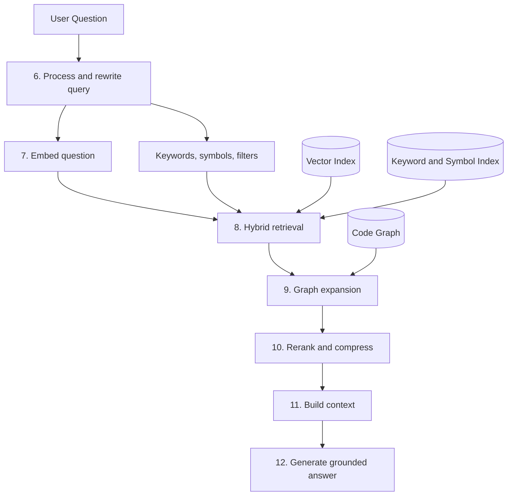
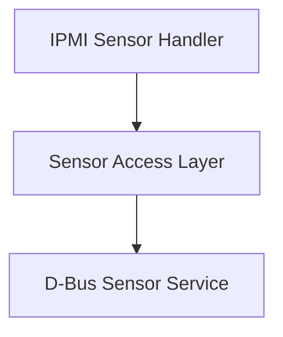

<style>
.term {
  font-weight: 600;
  text-decoration: underline 3px #005A9C;
  text-underline-offset: 4px;
}

.reference-box {
  background: #EAF2F8;
  color: #17202A;
  border: 2px solid #1F618D;
  border-left-width: 8px;
  border-radius: 6px;
  padding: 1rem 1.25rem;
  margin: 1rem 0;
}

.reference-box a {
  color: #0B4F71;
  font-weight: 600;
  text-decoration: underline 2px;
  text-underline-offset: 3px;
}
</style>

> **Scope:** This page describes the implementation design of [Repository RAG](repository-rag.md): how to index a repository and retrieve evidence from it.
>
> **Status:** Design stage. Not yet fully implemented.

> **Example scope:** Names, file paths, line numbers, and scores are simplified examples, not verified repository records.

A large repository does not fit in an LLM's context window.

A <span class="term">Repository RAG pipeline</span> searches the repository first, then gives the LLM only the relevant evidence.

> **Core idea:** Retrieve first, generate second.

---

## Why It Is Needed

A repository holds source code, build scripts, configuration, service definitions, design documents, debug notes, and historical fixes.

Sending all of it to an LLM causes:

- High token cost
- Irrelevant context
- Slow responses
- Lower precision
- More hallucination

Repository RAG answers one question:

> Which repository evidence is relevant to the question?

---

## Pipeline Overview

Two phases: build indexes offline, then search them online.

### Phase 1: Offline Indexing



### Phase 2: Online Retrieval



---

## Phase 1: Offline Indexing

### 1. Ingest Files

Load supported files: C and C++ sources, headers, build scripts, configuration, systemd unit files, Markdown, and debug notes.

Each file keeps its metadata:

```json
{
  "repository": "openbmc/phosphor-host-ipmid",
  "branch": "master",
  "commit_id": "abc123",
  "file_path": "dbus-sdr/sensorcommands.cpp",
  "file_type": "cpp"
}
```

Ingestion only loads files. Symbols and line ranges come in the next step.

---

### 2. Chunk and Enrich

**Chunking** splits each file into meaningful units called chunks: a function, class, struct, configuration section, or documentation section.

Each chunk inherits its file metadata and adds module, symbol name, and line range:

```json
{
  "chunk_id": "chunk-1024",
  "content": "...",
  "metadata": {
    "repository": "openbmc/phosphor-host-ipmid",
    "file_path": "dbus-sdr/sensorcommands.cpp",
    "module_name": "IPMI Sensor",
    "symbol_name": "GetSensorReading handler",
    "start_line": 120,
    "end_line": 178
  }
}
```

```text
Good chunk: a complete function with signature, body, comments, and metadata
Poor chunk: a fixed-size block that cuts a function in half
```

Complete chunks give more precise retrieval and traceable evidence.

**Enrichment** (optional) adds searchable fields to each chunk: summary, dependencies, called functions, configuration keys, and error codes.

It helps match the user's words to the repository's words:

```text
User query:         Read temperature value
Repository symbol:  GetSensorReading
Enrichment summary: Reads a sensor value through D-Bus
```

Enrichment does not replace source code. A summary, especially an LLM-generated one, can be wrong. Treat it as a search aid, never as evidence. Findings cite the original chunk.

---

### 3. Embedding

An embedding model turns each chunk into a vector. Chunks with similar meaning get nearby vectors, even when the wording differs:

```text
Read the current sensor value  ≈  Query sensor reading
```

Vectors go into a vector index, for example FAISS, pgvector, Qdrant, Chroma, Azure AI Search, or Pinecone.

---

### 4. Keyword and Symbol Index

Code contains exact names that embedding search can miss:

```text
GetSensorReading
xyz.openbmc_project.Sensor
libmctp
mctpd
```

Index file names, functions, classes, service names, configuration keys, error codes, log messages, and protocol names, using BM25, full-text search, symbol tables, Language Server Protocol data, or AST data.

| Method | Finds |
|---|---|
| Embedding search | Similar meaning |
| Keyword search | Exact or near-exact text |
| Symbol search | Code identifiers |

---

### 5. Code Graph

A code graph records how repository elements relate:

```text
Function A calls Function B
File A includes Header B
Module A depends on Library B
Service A starts Daemon B
Daemon B publishes D-Bus Interface C
```

Call and include edges come from static analysis. Cross-process links such as D-Bus and systemd must be extracted from service and interface definitions.

<aside class="reference-box" aria-label="IPMI sensor example references">
<strong>Reference repositories</strong>
<ul>
<li><a href="https://github.com/openbmc/phosphor-host-ipmid" target="_blank" rel="noopener noreferrer">openbmc/phosphor-host-ipmid</a></li>
<li><a href="https://github.com/openbmc/dbus-sensors" target="_blank" rel="noopener noreferrer">openbmc/dbus-sensors</a></li>
<li><a href="https://github.com/openbmc/entity-manager" target="_blank" rel="noopener noreferrer">openbmc/entity-manager</a></li>
</ul>

<strong>Reference documentation</strong>
<ul>
<li><a href="https://github.com/openbmc/dbus-sensors/blob/master/README.md" target="_blank" rel="noopener noreferrer">D-Bus sensor interfaces</a></li>
<li><a href="https://github.com/openbmc/entity-manager/blob/master/docs/my_first_sensors.md" target="_blank" rel="noopener noreferrer">Entity Manager sensor setup</a></li>
</ul>
</aside>

Simplified example:



Vector search finds similar content. A code graph finds connected content.

---

## Phase 2: Online Retrieval

### 6. Process and Rewrite the Query

Question:

```text
How does the IPMI sensor reading flow work?
```

Query processing splits it into inputs for different search methods:

```text
Semantic query:     Explain how an IPMI request retrieves a sensor value.
Keywords:           IPMI, sensor, reading, GetSensorReading
Candidate symbols:  GetSensorReading
Metadata filters:   repository (from routing), file type: C or C++
```

```text
Semantic query    → Vector Search
Keywords          → Keyword Search
Candidate symbols → Symbol Search
Metadata filters  → Metadata Filtering
```

The repository filter comes from [Multi-Domain Expert Routing](multi-domain-expert-routing.md).

**Query rewrite** fixes vague or differently worded questions: it normalizes terms, expands abbreviations, and suggests symbols.

```text
User query:      How sensor reading works?
Rewritten query: Explain the execution flow of an IPMI sensor read request.
Expanded terms:  GetSensorReading, sensorcommands.cpp, D-Bus sensor service
```

Rewritten queries and candidate symbols are search hints. They are not evidence and not findings.

---

### 7. Embed the Question

Convert the semantic query into a vector, so it can be compared with chunk vectors in the next step.

---

### 8. Hybrid Retrieval

Run all four methods and merge their results into one candidate set:

```text
Vector Search + Keyword Search + Symbol Search + Metadata Filtering
    = Candidates
```

Example vector scores:

```text
0.95  IPMI Sensor Handler chunk
0.91  Sensor Access Layer chunk
0.84  D-Bus Sensor Service chunk
0.42  Unrelated Module chunk
```

A similarity score marks a candidate. It does not prove the candidate answers the question.

No single method is enough:

| Method | Finds | May miss |
|---|---|---|
| Embedding search | Similar meaning | Exact names, error codes, macros, configuration keys |
| Keyword and symbol search | Exact identifiers | Similar wording, design documents |
| Code graph | Connected components | Debug notes, historical fixes, unlinked but related code |

---

### 9. Graph Expansion

Retrieval may find only part of a flow. The code graph adds connected chunks such as callers, callees, and dependent services:

```text
IPMI Sensor Handler → Sensor Access Layer → D-Bus Sensor Service
```

This keeps the answer from resting on one isolated function.

---

### 10. Rerank and Compress

**Rerank.** Score each candidate on semantic relevance, keyword and symbol match, file path, graph distance, chunk completeness, commit relevance, source freshness, and duplication. Drop weak and duplicate candidates. The best K chunks become the **Top-K evidence**.

```text
Candidate 1: semantic 0.95, graph distance 0
Candidate 2: semantic 0.91, graph distance 1
Candidate 3: semantic 0.84, graph distance 2
Candidate 4: weak evidence (removed)
```

**Compress.** If Top-K is larger than the LLM's context budget, remove duplicates, merge overlaps, and keep only relevant line ranges.

```text
Before: 20 chunks, 12,000 tokens
After:   8 chunks,  4,000 tokens
```

Compression must keep repository, branch, commit ID, file path, symbol, line range, and relationship path. Evidence must stay reviewable.

---

### 11. Build the Context

Assemble the selected evidence:

```text
User Question:
How does the IPMI sensor reading flow work?

Evidence 1:
File: dbus-sdr/sensorcommands.cpp
Symbol: GetSensorReading handler
Lines: 120-178
Commit: abc123
Content: ...

Evidence 2:
File: sensor_service.cpp
Symbol: Sensor value interface
Lines: 40-96
Commit: abc123
Content: ...

Relationships:
IPMI Sensor Handler → D-Bus Sensor Interface → Sensor Service
```

The LLM gets the question, Top-K chunks with metadata, relationships, and response instructions. It does not get the whole repository.

---

### 12. Generate a Grounded Answer

The LLM explains the evidence. The answer may include related files, call flow, evidence limits, and an optional Mermaid diagram.

Each statement should carry one label:

```text
Confirmed by evidence
Inferred from relationships
Possible hypothesis
Missing evidence
```

A hypothesis must not read as a confirmed fact. A generated diagram only shows retrieved relationships. It does not replace evidence.

---

## Traceability

Every chunk keeps its origin:

```text
Repository, Branch, Commit ID, File path, Symbol,
Line range, Retrieval score, Relationship path
```

Example:

```text
Finding:
The IPMI handler reads a sensor value through a D-Bus interface.

Evidence:
File: dbus-sdr/sensorcommands.cpp
Symbol: GetSensorReading handler
Lines: 120-178
Commit: abc123

Relationship:
IPMI Sensor Handler → D-Bus Sensor Interface → Sensor Service
```

> Repository RAG should produce evidence-based answers, not only plausible ones.

---

## Limits

- Retrieval only finds what was ingested and indexed.
- Quality depends on index freshness, chunk quality, metadata coverage, and graph completeness.
- Source code does not show runtime behavior, hardware conditions, configuration drift, or deployment state.

Real investigations also need logs, crash dumps, git history, test results, and human expertise.

---

## Integration with RootPilot

[RootPilot](https://github.com/ziyingchen-dev/RootPilot) is an evidence-driven debugging framework. [Routing RAG](routing-rag.md) holds repository-level metadata. [Multi-Domain Expert Routing](multi-domain-expert-routing.md) uses it to choose the repositories. Repository RAG then searches only those repositories and passes ranked, traceable evidence to RootPilot.

```text
Issue and Logs
    ↓
Multi-Domain Expert Routing  ← Routing RAG
    ↓
Repository RAG
    ↓
Ranked Repository Evidence
    ↓
RootPilot: hypothesis, evaluation, root-cause ranking
```

```text
Routing RAG:                  Which repositories could be involved?
Repository RAG:               Which repository evidence is relevant?
RootPilot:                    What does all the evidence indicate about the probable root cause?
```

Two implementation paths:

1. Call existing MCP code-search tools. See [Repository RAG](../repository-rag.md).
2. Build the full pipeline on this page.

Existing tools cover parts of the pipeline. Their coverage of enrichment, query rewrite, and graph expansion is not validated.

---

## Summary

```text
1. Ingest and chunk the repository
2. Build vector, keyword, symbol, and graph indexes
3. Retrieve candidates with hybrid search
4. Expand and rerank related evidence
5. Generate an answer from the selected evidence
```

| Component | Responsibility |
|---|---|
| Embedding | Finds similar meaning |
| Keyword and symbol search | Finds exact identifiers |
| Code graph | Finds connected components |
| Reranker | Selects the strongest evidence |
| LLM | Explains the evidence |

> Repository RAG retrieves ranked, traceable repository evidence.
>
> RootPilot combines it with runtime, historical, experimental, and human evidence to reduce debugging uncertainty.