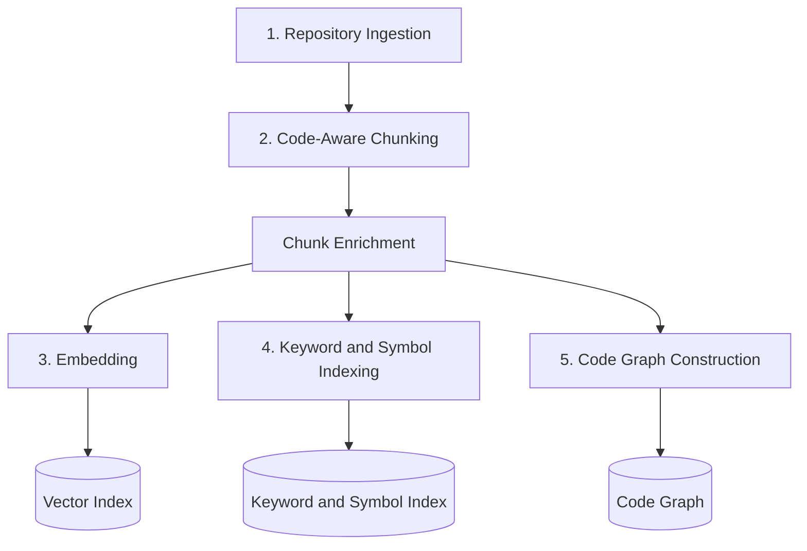
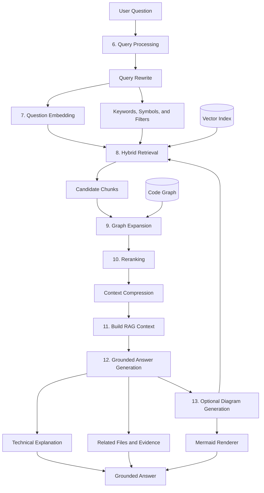
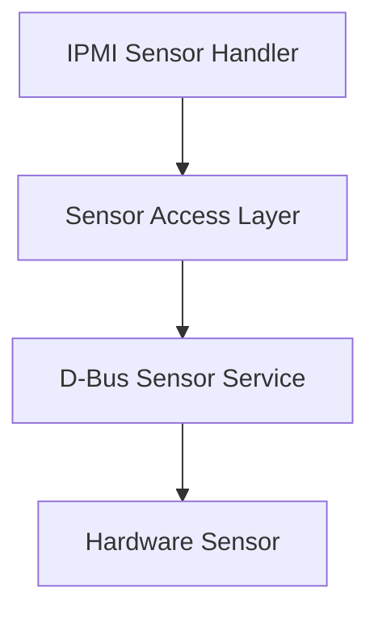
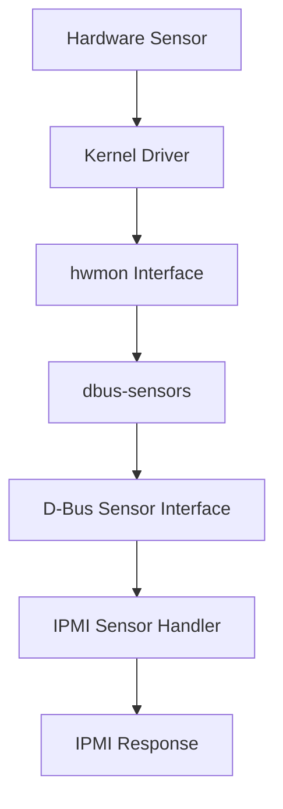

<style>
.term {
  font-weight: 600;
  text-decoration: underline 3px #005A9C;
  text-underline-offset: 4px;
}

.reference-box {
  background: #EAF2F8;
  color: #17202A;
  border: 2px solid #1F618D;
  border-left-width: 8px;
  border-radius: 6px;
  padding: 1rem 1.25rem;
  margin: 1rem 0;
}

.reference-box a {
  color: #0B4F71;
  font-weight: 600;
  text-decoration: underline 2px;
  text-underline-offset: 3px;
}
</style>

Large engineering repositories often cannot be provided to an LLM in full because they may exceed the model's context window.

A <mark style="background:#FFE082;color:#202020;padding:0 .2em;border-radius:.2em">Repository RAG pipeline</mark> retrieves relevant repository evidence before providing that evidence to the LLM.

> **Core idea:** Retrieve first, generate second.

> **Example scope:** Component names, file names, line numbers, scores, and vectors in this document are simplified examples. They are not verified repository records.

---

## Why Repository RAG Is Needed

An engineering repository may contain:

- Source code and headers
- Build scripts
- Configuration files
- Service definitions
- Design and architecture documents
- Debug notes and playbooks
- Historical fixes
- Logs and issue reports

Sending the entire repository to an LLM can cause:

- Excessive token usage
- Irrelevant context
- Slow responses
- Reduced answer precision
- Increased hallucination risk

Repository RAG addresses one question:

> Which repository evidence is relevant to the user's question?

---

## Pipeline Overview

The pipeline contains two major phases:

1. Offline Indexing and Knowledge Construction
2. Online Retrieval and Grounded Answer Generation

### Phase 1: Offline Indexing



The offline phase produces:

```text
Vector Index
Keyword and Symbol Index
Code Graph
```

### Phase 2: Online Retrieval and Generation



### Core Flow

```text
Repository
    ↓
Chunk and Index
    ↓
Retrieve and Rerank Evidence
    ↓
Generate a Grounded Answer
```

---

## Phase 1: Offline Indexing

### 1. Repository Ingestion

Repository ingestion discovers supported files and loads their raw content.

Common inputs include:

- C and C++ source files
- Header files
- Build scripts
- Configuration files
- systemd unit files
- Markdown documents
- Debug and architecture notes

File-level metadata may include:

```text
Repository
Branch
Commit ID
File path
File type
Indexed time
Raw content
```

Example:

```json
{
  "repository": "openbmc/phosphor-host-ipmid",
  "branch": "master",
  "commit_id": "abc123",
  "file_path": "dbus-sdr/sensorcommands.cpp",
  "file_type": "cpp",
  "indexed_at": "2026-09-24T10:30:00Z",
  "raw_content": "..."
}
```

Repository ingestion loads files. It does not yet generate symbols, line ranges, or searchable semantic units.

---

### 2. Code-Aware Chunking

Code-aware chunking parses each file and divides it into meaningful units called **chunks**.

A chunk may represent a:

- Function
- Method
- Class
- Struct
- Enum
- Configuration section
- Documentation section
- systemd unit section

Chunk-level metadata may include:

```text
Chunk ID
Module name
Symbol name
Start line
End line
Called symbols
Chunk content
```

Each chunk also inherits its file-level metadata.

Example:

```json
{
  "chunk_id": "chunk-1024",
  "content": "...",
  "metadata": {
    "repository": "openbmc/phosphor-host-ipmid",
    "branch": "master",
    "commit_id": "abc123",
    "file_path": "dbus-sdr/sensorcommands.cpp",
    "file_type": "cpp",
    "module_name": "IPMI Sensor",
    "symbol_name": "GetSensorReading handler",
    "start_line": 120,
    "end_line": 178
  }
}
```

A good chunk preserves a complete semantic unit and its source metadata.

```text
Good chunk:
A complete function with its signature, body, comments, and metadata.

Poor chunk:
A fixed-size block that cuts a function in half.
```

Good chunking improves retrieval precision and keeps evidence traceable.

#### Chunk Enrichment

Before indexing, the pipeline may enrich chunks with additional repository metadata.

Enrichment can improve retrieval quality and provide more context for reranking and answer generation.

Possible enrichment fields include:

```text
Symbol Summary
Dependencies
Called Functions
Referenced Services
Configuration Keys
Error Codes
Associated Documentation
```

Example:

```json
{
  "symbol_name": "GetSensorReading",
  "summary": "Reads a sensor value through a D-Bus interface",
  "dependencies": [
    "dbus-sensors"
  ],
  "called_symbols": [
    "getSensorMap",
    "readSensor"
  ],
  "config_keys": [
    "SensorNumber"
  ]
}
```

The enrichment process does not replace the original source code.

Instead, it adds searchable metadata that can improve retrieval, reranking, graph expansion, and evidence interpretation.

Enriched metadata may also improve matching between user terminology and repository terminology.

```text
User Query:
Read temperature value

Repository Symbol:
GetSensorReading

Enrichment Summary:
Reads a sensor value through D-Bus
```

The semantic summary helps retrieval systems discover relevant chunks even when the query does not contain the exact identifier.

---

### 3. Embedding

An embedding model converts each chunk into a numerical vector.

```text
Code Chunk
    ↓
Embedding Model
    ↓
[0.13, -0.22, 0.87, 0.44, ...]
```

Semantically related text may have nearby vectors even when the wording differs:

```text
Read the current sensor value
Get device measurement
Retrieve temperature data
Query sensor reading
```

The vectors are stored in a vector index for semantic retrieval.

Possible implementations include:

- FAISS
- pgvector
- Qdrant
- Chroma
- Azure AI Search
- Pinecone

> Embedding represents semantic meaning as numerical coordinates.

---

### 4. Keyword and Symbol Indexing

Embedding search alone is insufficient for source code because code contains exact identifiers such as:

```text
GetSensorReading
xyz.openbmc_project.Sensor
libmctp
mctpd
```

A repository search system should also index:

- File names
- Functions and methods
- Classes and structs
- Service names
- Configuration keys
- Error codes
- Log messages
- Library and protocol names

Possible implementations include:

- BM25
- Full-text search
- Symbol tables
- Language Server Protocol data
- Abstract Syntax Tree data

The retrieval methods have different strengths:

```text
Embedding Search:
Finds semantically similar content

Keyword Search:
Finds exact or near-exact text

Symbol Search:
Finds structured code identifiers
```

Repository RAG therefore uses hybrid retrieval instead of vector search alone.

---

### 5. Code Graph Construction

A code graph records relationships between repository elements.

Possible relationships include:

```text
Function A calls Function B
File A includes Header B
Module A depends on Library B
Service A starts Daemon B
Daemon B publishes D-Bus Interface C
Function A reads Configuration B
Function A sends Message B
```

<aside class="reference-box" aria-label="IPMI sensor example references">
<strong>Reference repositories</strong>
<ul>
<li><a href="https://github.com/openbmc/phosphor-host-ipmid" target="_blank" rel="noopener noreferrer">openbmc/phosphor-host-ipmid</a></li>
<li><a href="https://github.com/openbmc/dbus-sensors" target="_blank" rel="noopener noreferrer">openbmc/dbus-sensors</a></li>
<li><a href="https://github.com/openbmc/entity-manager" target="_blank" rel="noopener noreferrer">openbmc/entity-manager</a></li>
</ul>

<strong>Reference documentation</strong>
<ul>
<li><a href="https://github.com/openbmc/dbus-sensors/blob/master/README.md" target="_blank" rel="noopener noreferrer">D-Bus sensor interfaces</a></li>
<li><a href="https://github.com/openbmc/entity-manager/blob/master/docs/my_first_sensors.md" target="_blank" rel="noopener noreferrer">Entity Manager sensor setup</a></li>
</ul>
</aside>

A simplified relationship may look like:



Vector search finds similar content. A code graph finds connected content.

---

## Phase 2: Online Retrieval and Generation

### 6. Query Processing

Consider this question:

```text
How does the IPMI sensor reading flow work?
```

Query processing may produce:

```text
Intent:
code_flow_explanation

Entities:
protocol: IPMI
domain: sensor
operation: read

Semantic query:
Explain how an IPMI request retrieves a sensor value.

Keywords:
IPMI
sensor
reading
GetSensorReading

Candidate symbols:
GetSensorReading

Metadata filters:
file type: C or C++
```

These retrieval inputs are routed to different search methods:

```text
Semantic query    → Vector Search
Keywords          → Keyword Search
Candidate symbols → Symbol Search
Metadata filters  → Metadata Filtering
```

Candidate terms are retrieval hints. They are not confirmed repository modules or findings.

#### Query Rewrite

User questions are often incomplete, ambiguous, or expressed using terminology that differs from the repository.

A query rewriting stage may transform the original question into one or more retrieval-oriented queries.

Example:

```text
User Query:
How sensor reading works?

Rewritten Query:
Explain the execution flow of an IPMI sensor read request.

Expanded Query:
GetSensorReading
sensorcommands.cpp
D-Bus sensor service
sensor value retrieval
```

Query rewriting can:

- Improve retrieval recall
- Normalize terminology
- Expand abbreviations
- Generate candidate symbols
- Reduce ambiguity

The rewritten query is not treated as repository evidence.

Instead, it acts as a retrieval aid used to locate relevant repository content.

Query rewriting does not generate answers.

Its goal is only to improve evidence retrieval.

---

### 7. Question Embedding

The semantic query is converted into a query vector:

```text
Semantic Query
    ↓
Embedding Model
    ↓
Question Vector
```

This stage only creates the vector. Repository retrieval occurs in the next stage.

> Query processing decides what to search. Question embedding converts the semantic query into a searchable vector.

---

### 8. Hybrid Retrieval

Hybrid retrieval combines several retrieval methods:

```text
Vector Search
    +
Keyword Search
    +
Symbol Search
    +
Metadata Filtering
    =
Hybrid Retrieval Candidates
```

Vector search compares the question vector with repository chunk vectors.

```text
Question Vector
    ↕
Repository Chunk Vectors
```

Example candidate scores:

```text
0.95  IPMI Sensor Handler chunk
0.91  Sensor Access Layer chunk
0.84  D-Bus Sensor Service chunk
0.42  Unrelated Module chunk
```

A similarity score identifies retrieval candidates. It does not confirm that a candidate contains the final answer.

Keyword and symbol search find exact identifiers.

Metadata filtering limits candidates by fields such as:

```text
Repository
Branch
Commit ID
File type
Module
File path
```

The result is a merged set of candidate chunks.

#### Retrieval Coverage

Different retrieval methods may discover different evidence.

Example:

```text
User Query:
Why does IPMI return an invalid sensor value?

Vector Search:
Finds semantically related sensor-reading logic

Keyword Search:
Finds specific error messages

Symbol Search:
Finds GetSensorReading

Graph Expansion:
Finds dependent services and related call paths
```

A repository investigation should not rely on a single retrieval method.

Relevant evidence may exist in source code, configuration files, documentation, service definitions, logs, or related dependencies.

---

### 9. Graph Expansion

Initial retrieval may find only one part of a larger flow.

The code graph can expand an initial result to connected components:

```text
IPMI Sensor Handler
    ↓
Sensor Access Layer
    ↓
D-Bus Sensor Service
    ↓
Hardware Sensor
```

Graph expansion supports:

- Call-flow analysis
- Data-flow analysis
- Service dependencies
- Module interaction
- Initialization sequences
- Error propagation

Graph expansion prevents the answer from relying on one isolated function.

---

### 10. Reranking

Hybrid retrieval and graph expansion may produce more candidates than the LLM should receive.

A reranker may evaluate:

- Semantic relevance
- Keyword match
- Symbol match
- File-path relevance
- Graph distance
- Chunk completeness
- Commit relevance
- Source freshness
- Duplicate content

Example:

```text
Candidate 1: semantic match 0.95, graph distance 0
Candidate 2: semantic match 0.91, graph distance 1
Candidate 3: semantic match 0.84, graph distance 2
Candidate 4: weak or unrelated evidence
```

Weak and duplicate candidates are removed.

The highest-ranked candidates become the **Top-K evidence**.

```text
Top-K:
The K highest-ranked evidence chunks selected for context construction.
```

#### Context Compression

The retrieved Top-K evidence may exceed the context budget available to the LLM.

A context compression stage may reduce redundant or low-value content while preserving traceability.

Possible strategies include:

- Remove duplicate chunks
- Merge overlapping findings
- Keep only relevant line ranges
- Prioritize highly ranked evidence
- Summarize supporting evidence

Example:

```text
Before Compression:
20 retrieved chunks
12,000 tokens

After Compression:
8 evidence chunks
4,000 tokens
```

Context compression should preserve:

```text
Repository
Branch
Commit ID
File Path
Symbol Name
Line Range
Relationship Path
```

Evidence references should remain reviewable after compression.

The goal is to maximize information density without removing critical evidence.

---

### 11. Build RAG Context

The selected evidence is assembled into a structured context:

```text
User Question:
How does the IPMI sensor reading flow work?

Evidence 1:
File: dbus-sdr/sensorcommands.cpp
Symbol: GetSensorReading handler
Lines: 120-178
Commit: abc123
Content:
...

Evidence 2:
File: sensor_service.cpp
Symbol: Sensor value interface
Lines: 40-96
Commit: abc123
Content:
...

Relationships:
IPMI Sensor Handler
    → D-Bus Sensor Interface
    → Sensor Service
```

The LLM receives:

- The original question
- Top-K repository chunks
- File and symbol metadata
- Graph relationships
- Relevant documentation
- Response instructions

The LLM receives selected evidence instead of the entire repository.

---

### 12. Grounded Answer Generation

The LLM analyzes the retrieved context and generates an answer.

The response may include:

- Technical explanation
- Evidence summary
- Related files
- Call or data flow
- Evidence limitations
- Optional Mermaid diagram

The answer should distinguish between:

```text
Confirmed by evidence
Inferred from relationships
Possible hypothesis
Missing evidence
```

This prevents a hypothesis from being presented as a confirmed fact.

---

### 13. Optional Diagram Generation

The LLM may convert verified relationships into Mermaid syntax:



The LLM generates Mermaid syntax. A Mermaid renderer converts the syntax into a visual diagram.

The diagram is a presentation of retrieved relationships. It is not a replacement for repository evidence.

---

## Why Hybrid Retrieval Is Required

Each retrieval method has limitations.

Embedding search may miss:

- Exact function names
- Error codes
- Macros
- Configuration keys
- Generated identifiers
- Call relationships

Keyword search may miss:

- Semantically similar wording
- Questions without exact identifiers
- Related design documents

Code graph search may miss:

- Debug notes
- Historical fixes
- Design explanations
- Semantically related code without direct dependencies

A complete retrieval system therefore combines:

```text
Semantic Search
    +
Keyword and Symbol Search
    +
Code Graph Search
    =
Hybrid Repository Retrieval
```

---

## Evidence and Traceability

Every retrieved chunk should preserve its origin.

Recommended evidence metadata includes:

```text
Repository
Branch
Commit ID
File path
Symbol name
Line range
Retrieval score
Relationship path
```

Example:

```text
Finding:
The IPMI handler reads a sensor value through a D-Bus interface.

Evidence:
File: dbus-sdr/sensorcommands.cpp
Symbol: GetSensorReading handler
Lines: 120-178
Commit: abc123

Relationship:
IPMI Sensor Handler
    → D-Bus Sensor Interface
    → Sensor Service
```

Traceability makes findings reviewable and auditable.

> Repository RAG should produce evidence-based answers, not only plausible answers.

---

## Where Repository RAG Fits

Repository RAG transforms a large repository into searchable and traceable evidence that an LLM can use.

The retrieval subsystem outputs ranked repository evidence. The complete Repository RAG pipeline uses that evidence to generate a grounded answer.

Root-cause conclusions, debugging decisions, and solution recommendations remain the responsibility of engineers or downstream investigation systems.

Real-world investigations may also require:

- Issue reports
- Runtime logs
- Crash dumps
- Git history
- Test results
- System architecture knowledge
- Human expertise

Repository RAG can therefore serve as a supporting subsystem in a broader engineering investigation workflow.

Repository RAG improves evidence discovery, but retrieval quality depends on:

- Index freshness
- Chunk quality
- Metadata coverage
- Graph completeness
- Repository observability

Incomplete indexing may limit the evidence available to downstream reasoning systems.

Retrieval systems can only retrieve information that has been successfully ingested, processed, and indexed.

---

## Planned RootPilot Integration

> **Status:** Repository RAG is a planned RootPilot subsystem and has not yet been fully implemented.

[RootPilot](https://github.com/ziyingchen-dev/RootPilot) is an evidence-driven debugging framework for existing engineering workspaces.

Repository RAG will retrieve ranked and traceable repository evidence. RootPilot will combine that evidence with other investigation data to identify probable root causes.

### Planned Workflow

```text
Issue and Logs
    ↓
Evidence Collection
    ↓
Repository RAG
    ↓
Ranked Repository Evidence
    ↓
Hypothesis Generation
    ↓
Evidence Evaluation
    ↓
Root-Cause Ranking
    ↓
Solution and Validation
```

Repository RAG will handle:

```text
Code-aware chunking
Embedding and indexing
Hybrid retrieval
Symbol search
Graph expansion
Evidence reranking
Repository traceability
```

RootPilot will handle:

```text
Issue analysis
Evidence correlation
Hypothesis generation
Confidence updates
Root-cause investigation
Solution proposal
Validation planning
Human feedback
```

### Example

For this issue:

```text
IPMI returns an incorrect sensor reading.
```

Repository RAG may retrieve:

```text
GetSensorReading handler
D-Bus sensor interfaces
Sensor configuration
Related call relationships
```

RootPilot can combine this repository evidence with:

```text
Issue description
Runtime logs
Git history
Test and experiment results
Human feedback
```

Repository RAG answers:

```text
Which repository evidence is relevant?
```

RootPilot answers:

```text
What does the combined evidence indicate about the probable root cause?
```

Source code alone does not fully represent runtime behavior, hardware conditions, configuration drift, deployment state, or operational failures.

Repository RAG provides repository evidence. RootPilot evaluates it together with runtime, historical, experimental, and human evidence.

---

## Summary

Remember these five steps:

```text
1. Ingest and chunk the repository
2. Build vector, keyword, symbol, and graph indexes
3. Retrieve candidates through hybrid search
4. Expand and rerank related evidence
5. Generate an answer from the selected evidence
```

### One-Sentence Definition

> Repository RAG converts a large repository into searchable evidence, retrieves the evidence relevant to a question, and gives that evidence to an LLM to generate a grounded answer.

### Component Responsibilities

```text
Embedding:
Finds semantically similar content

Keyword and Symbol Search:
Finds exact identifiers

Code Graph:
Finds connected components

Reranker:
Selects the strongest evidence

LLM:
Explains the retrieved evidence

Mermaid:
Renders verified relationships
```

### Central Principle

> Repository RAG retrieves ranked and traceable repository evidence.
>
> RootPilot will combine repository evidence with runtime, historical, experimental, and human evidence to reduce debugging uncertainty.