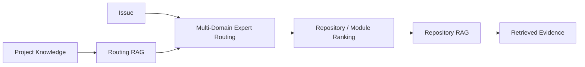

<style>
.term-blue {
  font-weight: 600;
  text-decoration: underline 3px #005A9C;
  text-underline-offset: 4px;
}
.term-red {
  font-weight: 600;
  text-decoration: underline 3px #D32F2F;
  text-underline-offset: 4px;
}
.reference-box mark {
     background:#FFF9C4;
     color:#17202A;
     padding:0 .25em;
     border-radius:3px
}
</style>

Engineers investigate with logs, telemetry, crash traces, and issue descriptions, not repository names.

In multi-repository ecosystems such as OpenBMC, UEFI, and Linux platform stacks, finding the right investigation scope is often the first challenge.

<span class="term-blue">Multi-Domain Expert Routing</span> analyzes the available evidence and ranks the most likely repositories, subsystems, and modules before retrieval begins.

> **Core idea:** Route first, retrieve second.

> **Example scope:** Names and confidence scores below are simplified examples, not verified results.

---

## How It Works

1. [RootPilot](https://github.com/ziyingchen-dev/RootPilot) builds a [Routing RAG](routing-rag.md) from project knowledge. It stores structured metadata on architecture and ownership.
2. When an issue arrives, routing matches it against Routing RAG.
3. The ranked repositories and modules are passed to [Repository RAG](repository-rag.md).



---

## Example

Input:

```text
TMP75 temperature sensor reports no reading.
The sensor is not exposed through D-Bus.
No obvious errors are reported by dbus-sensors.
```

Output:

```json
{
  "repositories": [
    { "name": "openbmc/entity-manager", "confidence": 0.78 },
    { "name": "openbmc/dbus-sensors",   "confidence": 0.15 },
    { "name": "openbmc/phosphor-hwmon", "confidence": 0.07 }
  ]
}
```

The sensor is missing from D-Bus and `dbus-sensors` reports no errors. Routing therefore ranks inventory configuration and FRU association above sensor-reading logic.

---

> Routing decides where the investigation starts.
> Repository RAG retrieves evidence within that scope.